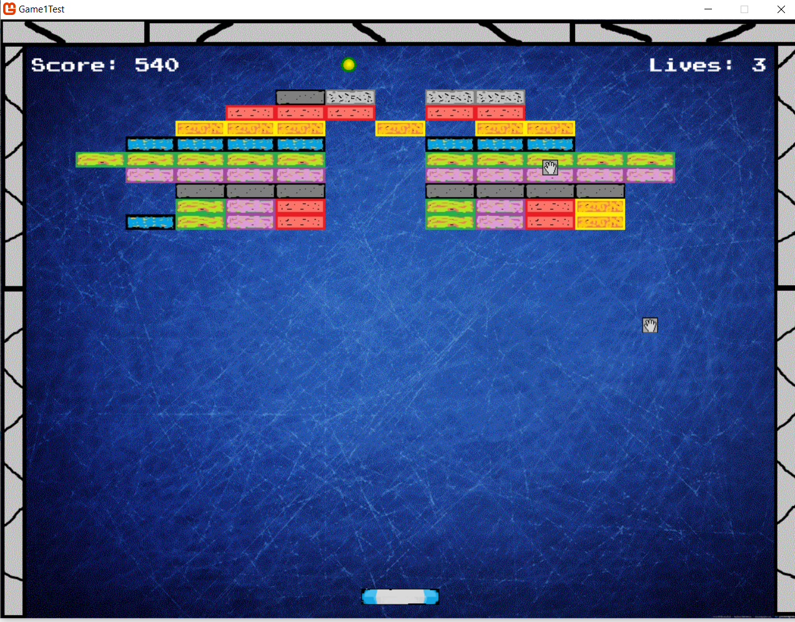
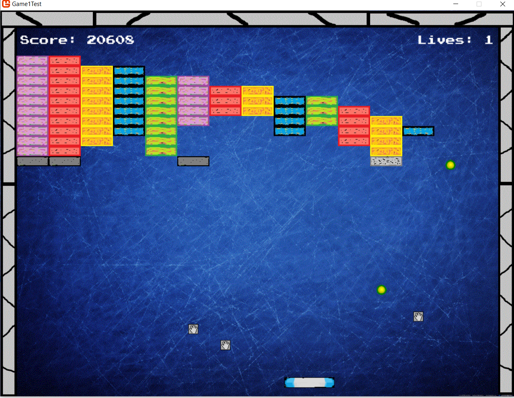
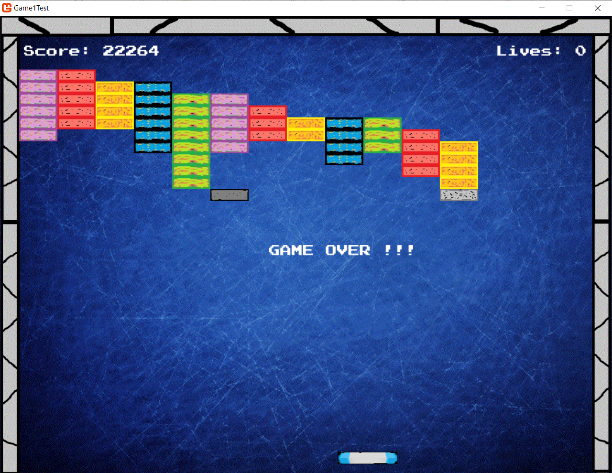

Arkanoid - it is a simple 2D game developed using C# and MonoGame. 

The player controls a paddle that is used to deflect a ball. When in contact 
with the block formation, it breaks the block that was hit. The task is to clear
 all the blocks from the field without letting the ball leave the bottom edge. 

You can play this game by running Game1Test.exe in bin\Windows\Release. 

Game views: 

 

 

 
